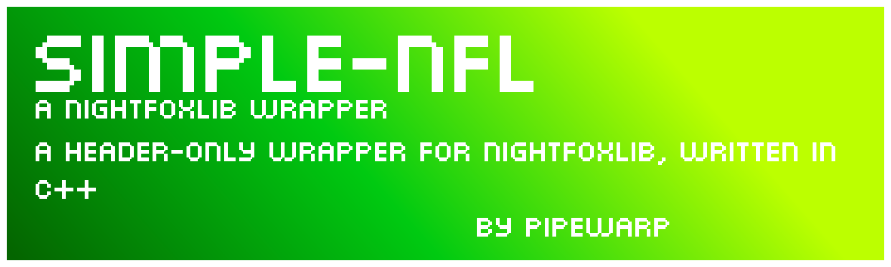
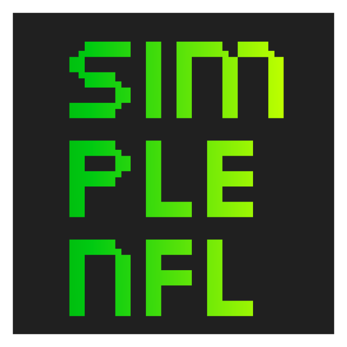

# SimpleNFL
A C++ header-only wrapper for NightFoxLib.
Putting a sprite on the screen used to take four lines of code, it now only takes one.
There are also ease-of-use functions included, like easy touch detection and button presses.

<p align="center">

</p>

# Installation
Download ```simplenfl.h``` 

Simply include it in your project to begin using it.

# [Documentation is located here.](https://github.com/PipeWarp/SimpleNFL/wiki)

# Credits

- PipeWarp
- KonPet
- ngawung
- PolyMars